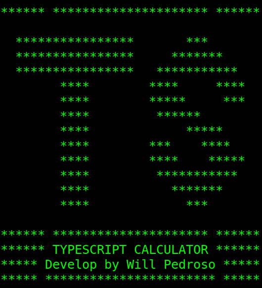

# Typescript Prompt Calculator



A simple prompt calculator built entirely in Typescript.

___

## Instructions to use:

Clone the repository:
```
git clone https://github.com/willypedroso/ts-prompt-calculator
```

Enter in the directory:
```
cd ts-prompt-calculator
```

Resolve the dependencies:
```
npm install
```

Then run the code:
```
npm run start
```

***
Feel free to open an issue and suggest improvements.
